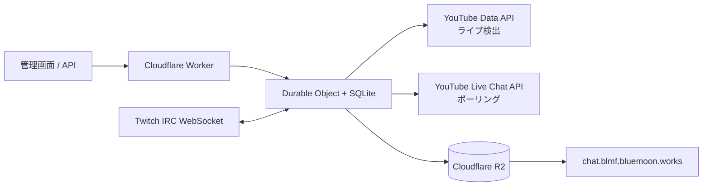

# BLMF Chat Relay

YouTube と Twitch のライブチャットを Cloudflare Durable Objects + R2 でひとつのコメントフィードへ集約する Cloudflare Workers アプリです。

YouTube は Data API の `liveChatMessages.list` を Durable Object Alarm でポーリングします。Twitch は `wss://irc-ws.chat.twitch.tv:443` へ匿名 IRC-over-WebSocket で接続し、`justinfan#####` guestとしてread-only受信します。Twitch用OAuth、Client ID、EventSub subscription、Webhook secretは不要です。詳細は [Twitch設定](docs/twitch.md) を参照してください。

このサービスはイベント等の限定期間だけ利用する運用を前提としています。YouTube/Twitchは管理画面から個別に開始・停止できます。

## 主な機能

- YouTubeチャンネルID、`@handle`、チャンネルURLから現在のライブ配信を自動検出
- 既知の動画IDを使って限定公開ライブを直接指定するE2E専用経路
- YouTubeが返す `pollingIntervalMillis` を尊重したライブチャット取得
- Twitch匿名IRCの `PRIVMSG` / `CLEARMSG` / `CLEARCHAT` を取得
- Twitch `PING/PONG`、`RECONNECT`、socket close/error時の自動再接続
- Twitchイベントも既存SQLiteキューへ永続化してから直列処理へ合流
- YouTube/Twitch双方のコメントを同じ `comments.json` とdelta APIへ統合
- 削除・BAN/timeout/clearをスナップショットとdeltaへ反映
- Durable Object AlarmによるYouTube polling、R2 flush、Twitch接続watchdog
- R2の `comments.json` と配信別archiveを定期更新
- 手動開始・停止用の管理画面とBearer認証API
- 停止後の最終R2反映失敗時の再試行

## 構成



Durable Objectは1つだけ使用し、リレー状態・YouTubeページトークン・コメント・差分イベント・Twitch受信キューをSQLiteに保持します。

Twitchのoutbound WebSocketはCloudflareのWebSocket Hibernation対象ではありません。Twitch有効中は通常のoutbound接続として保持し、DO再生成時にも復帰できるよう約60秒周期のAlarmをwatchdogとして利用します。

## 出力

### 最新コメント

`https://chat.blmf.bluemoon.works/comments.json`

```json
[
  {
    "name": "視聴者名",
    "message": "コメント本文",
    "created_at": "2026-08-25T01:02:03.000Z"
  }
]
```

公開形式はプラットフォームによらず `name`, `message`, `created_at` の3項目です。`created_at` はRFC 3339 / ISO 8601文字列です。

### 差分API

- `/api/comments/delta`
- `/api/comments/delta/simple`

Twitchの内部コメントIDは `twitch:<source-namespace>:<message-id>` としてYouTube IDとの衝突を防ぎます。新規IRC環境では `<source-namespace>` はchannel loginです。EventSub版から同一channelを引き継いだ環境では、既存コメントとの削除互換性を保つため保存済みの数値broadcaster IDを継続利用する場合があります。

### 状態

`https://chat.blmf.bluemoon.works/status.json`

YouTube/Twitchの稼働状態、コメント数、次回処理時刻、直近エラー、各JSON URLを含みます。

### 配信別アーカイブ

YouTube動画があるrun:

`streams/{videoId}/comments.json`

Twitch単独run:

`streams/twitch-<channel>/<runId>/comments.json`

## YouTube側の流れ

1. `/api/start` または管理画面で開始する。
2. チャンネルを解決する。
3. 現在ライブ中の動画を検索する。
4. `activeLiveChatId` を取得する。
5. `liveChatMessages.list` でコメントを取得する。
6. YouTubeが返す待機時間に従って次のAlarmを設定する。
7. 既定では15秒ごとにR2を更新する。
8. 配信終了を検出すると最終スナップショットを保存してYouTube側を停止する。

開始時点でライブ配信が見つからない場合は既定で5分ごとに再検索します。

## Twitch側の流れ

1. `/api/twitch/start` または管理画面の「Twitch 開始」を押す。
2. DOが `wss://irc-ws.chat.twitch.tv:443` へ接続する。
3. `CAP REQ`, `PASS SCHMOOPIIE`, `NICK justinfan#####`, `JOIN` を送る。
4. IRCイベントを正規化して `twitch_pending` へ永続化する。
5. Alarm / `runSerially` 経由で既存コメント状態へ適用する。
6. R2を既存のflush間隔で更新する。
7. `PING` には即時 `PONG`、`RECONNECT` / close / errorでは再接続する。

YouTubeが停止してもTwitchは個別に停止するまで継続します。

## セットアップ

### 必要なもの

- Node.js 22以上
- Cloudflareアカウント
- R2
- YouTube Data API v3を有効化したGoogle Cloudプロジェクト
- YouTube Data API key

Twitch DeveloperアプリやTwitch OAuth設定は不要です。

### 依存関係

```bash
npm install
```

### R2バケット

```bash
npx wrangler login
npx wrangler r2 bucket create blmf-chat-relay
```

### チャンネル設定

`wrangler.jsonc`:

```jsonc
"DEFAULT_YOUTUBE_CHANNEL": "@your-youtube-channel",
"DEFAULT_TWITCH_CHANNEL": "your_twitch_login"
```

YouTubeは空欄にして管理画面/APIで指定することもできます。TwitchはIRC接続先をWorker設定で固定します。

### Secret

`.env.production` 等に次だけ設定します。

```dotenv
YOUTUBE_API_KEY="..."
ADMIN_TOKEN="..."
```

```bash
openssl rand -base64 32
npx wrangler deploy --secrets-file .env.production
```

`ADMIN_TOKEN` は十分長いランダム値を使ってください。

### R2カスタムドメイン

```bash
npx wrangler r2 bucket domain add blmf-chat-relay \
  --domain chat.blmf.bluemoon.works \
  --zone-id YOUR_ZONE_ID \
  --min-tls 1.2
```

別ドメインを使う場合は `PUBLIC_R2_BASE_URL` も変更します。

### CORS

```bash
npx wrangler r2 bucket cors set blmf-chat-relay \
  --file config/r2-cors.json
```

## 操作

デプロイ後のWorker URLの `/admin` を開きます。

```text
https://blmf-chat-relay.<YOUR_SUBDOMAIN>.workers.dev/admin
```

### 状態取得

認証不要です。

```bash
curl https://blmf-chat-relay.<YOUR_SUBDOMAIN>.workers.dev/api/status
```

### YouTube開始

```bash
curl -X POST \
  https://blmf-chat-relay.<YOUR_SUBDOMAIN>.workers.dev/api/start \
  -H "Authorization: Bearer $ADMIN_TOKEN" \
  -H "Content-Type: application/json" \
  -d '{"channel":"@your-channel"}'
```

### 限定公開YouTube E2E開始

```bash
curl -X POST \
  https://blmf-chat-relay.<YOUR_SUBDOMAIN>.workers.dev/api/e2e/start \
  -H "Authorization: Bearer $ADMIN_TOKEN" \
  -H "Content-Type: application/json" \
  -d '{"channel":"@your-channel","videoId":"XXXXXXXXXXX"}'
```

### YouTube停止

```bash
curl -X POST \
  https://blmf-chat-relay.<YOUR_SUBDOMAIN>.workers.dev/api/stop \
  -H "Authorization: Bearer $ADMIN_TOKEN"
```

### Twitch開始

```bash
curl -X POST \
  https://blmf-chat-relay.<YOUR_SUBDOMAIN>.workers.dev/api/twitch/start \
  -H "Authorization: Bearer $ADMIN_TOKEN"
```

### Twitch停止

```bash
curl -X POST \
  https://blmf-chat-relay.<YOUR_SUBDOMAIN>.workers.dev/api/twitch/stop \
  -H "Authorization: Bearer $ADMIN_TOKEN"
```

旧 `/api/twitch/eventsub` endpointはありません。

## ローカル開発

```bash
cp .dev.vars.example .dev.vars
npm run dev
```

`.dev.vars` に必要なのは `YOUTUBE_API_KEY` と `ADMIN_TOKEN` です。Twitch用secretはありません。

管理画面:

```text
http://localhost:8787/admin
```

## 設定値

| 変数 | 既定値 | 説明 |
|---|---:|---|
| `DEFAULT_YOUTUBE_CHANNEL` | 空 | YouTube開始時に省略した場合のチャンネル |
| `DEFAULT_TWITCH_CHANNEL` | `azumagbanjo` | Twitch IRC接続先login |
| `PUBLIC_R2_BASE_URL` | `https://chat.blmf.bluemoon.works` | 公開R2のベースURL |
| `R2_CURRENT_OBJECT_KEY` | `comments.json` | 最新コメントのオブジェクトキー |
| `R2_STATUS_OBJECT_KEY` | `status.json` | 状態JSONのオブジェクトキー |
| `DISCOVERY_INTERVAL_SECONDS` | `300` | YouTube配信未検出時の再検索間隔 |
| `R2_FLUSH_INTERVAL_SECONDS` | `15` | R2反映間隔 |

Secret:

| Secret | 説明 |
|---|---|
| `YOUTUBE_API_KEY` | YouTube Data API v3 API key |
| `ADMIN_TOKEN` | 開始・停止APIのBearer token |

## YouTube APIクォータ

ライブ未検出中の `search.list` は検索クォータを使用します。配信が見つかった後は検索を止め、ライブチャット取得へ移ります。コメント取得はYouTubeの `pollingIntervalMillis` を尊重します。

## 注意点

- YouTubeはリレー開始以前の全コメントを必ず遡れるわけではありません。
- Twitch IRCはリレー開始後に受信したイベントを対象にします。
- Twitch有効中のoutbound WebSocketはDO Hibernation対象外です。本サービスは限定期間利用を前提にしています。
- コメント数が非常に多い場合、単一JSON配列を繰り返し更新する方式の転送量が増えます。
- `comments.json` は公開データです。視聴者名とコメント本文を公開保存する運用について、各プラットフォームの規約・ポリシー・告知方針を確認してください。
- 管理画面を独自ドメインで公開する場合はCloudflare Access等の追加保護を推奨します。

詳しい内部設計は [`docs/design.md`](docs/design.md)、Twitch固有の設計は [`docs/twitch.md`](docs/twitch.md) を参照してください。

## 開発コマンド

```bash
npm run types
npm run typecheck
npm test
npm run test:runtime
npm run check
npm run deploy
```
