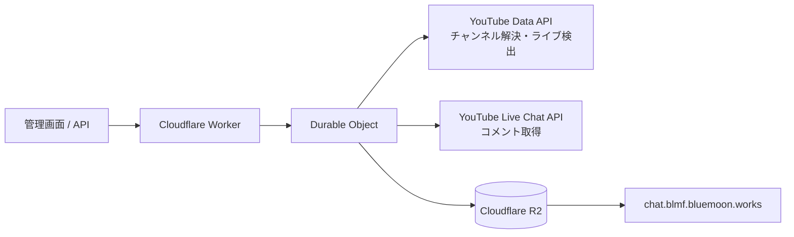

# BLMF Chat Relay

YouTube チャンネルを指定すると、現在アクティブなライブ配信を自動検出し、ライブチャットを Cloudflare R2 へ JSON 配列として定期保存する Cloudflare Workers アプリです。

配信ID・動画ID・ライブチャットIDを運用時に入力する必要はありません。管理画面で「開始」を押した時間だけ動作し、配信終了を検出すると自動停止します。

## 主な機能

- `UC...` のチャンネルID、`@handle`、YouTube チャンネルURLからチャンネルを解決
- 指定チャンネルの現在のライブ配信を自動検出
- YouTube が返す `pollingIntervalMillis` を守ってコメントを取得
- Durable Object と Alarm により、HTTP リクエストがなくても取得を継続
- R2 の `comments.json` を一定間隔で更新
- 配信別の `streams/{videoId}/comments.json` も同時更新
- 手動開始・停止用の管理画面と API
- YouTube 側で削除されたコメント、BANされた投稿者の過去コメントをスナップショットから除外
- ライブチャット無効時は待機扱いにせず、明示的なエラーとして停止
- 停止後の最終R2反映が失敗した場合は、YouTube APIを呼ばずR2書き込みだけを再試行
- APIキーと管理トークンを Cloudflare Secret として管理

## 構成



Durable Object は1つだけ使用し、リレー状態・ページトークン・取得済みコメントを SQLite に保持します。Alarm が次回の配信検索またはコメント取得を起動します。

## 出力

### 最新コメント

`https://chat.blmf.bluemoon.works/comments.json`

```json
[
  {
    "name": "視聴者名",
    "message": "コメント本文",
    "created_at": "2026-08-25T01:02:03.000Z"
  }
]
```

`created_at` は JSON に datetime 型がないため、RFC 3339 / ISO 8601 の文字列です。配列は投稿時刻の古い順です。

### 状態

`https://chat.blmf.bluemoon.works/status.json`

稼働状態、チャンネル、検出した配信、コメント数、次回処理時刻、直近エラー、各 JSON の URL を含みます。

### 配信別アーカイブ

`https://chat.blmf.bluemoon.works/streams/{videoId}/comments.json`

配信中も最新スナップショットへ更新し、配信終了・手動停止時に最終反映します。

## 動作の流れ

1. 管理画面または `/api/start` で開始する。
2. チャンネル指定をチャンネルIDへ解決する。
3. 現在ライブ中の動画を検索する。
4. 見つかった動画の `activeLiveChatId` を取得する。
5. コメントを取得し、YouTube が返す待機時間に従って次の Alarm を設定する。
6. 既定では15秒ごとに R2 の JSON を更新する。
7. 配信終了を検出すると最終スナップショットを保存して停止する。

開始時点でライブ配信が見つからない場合は、既定で5分ごとに再検索します。配信待機中に同じチャンネルでもう一度「開始・再検出」を押すと、次回検索を即時実行します。すでにコメント取得中の場合は、YouTube が指定したポーリング間隔を崩さず、そのまま継続します。

## 対応するチャンネル指定

- `UC123...` のようなチャンネルID
- `@blue-moon` のようなハンドル
- `https://www.youtube.com/@blue-moon`
- `https://www.youtube.com/channel/UC123...`
- `https://www.youtube.com/user/...` の旧username URL

`/c/...` 形式の旧カスタムURLは誤ったチャンネルを選ばないため受け付けません。YouTube のチャンネル画面から `@handle` またはチャンネルIDを使用してください。

## セットアップ

### 1. 必要なもの

- Node.js 22 以上
- Cloudflare アカウント
- Cloudflare で管理している `bluemoon.works` ゾーン
- YouTube Data API v3 を有効化した Google Cloud プロジェクト
- YouTube Data API 用 API キー

API キーは Google Cloud 側で YouTube Data API v3 のみに制限してください。コードや `wrangler.jsonc` には書かず、Secret として登録します。

### 2. 依存関係

```bash
npm install
```

### 3. R2 バケット作成

```bash
npx wrangler login
npx wrangler r2 bucket create blmf-chat-relay
```

バケット名を変更する場合は `wrangler.jsonc` の `r2_buckets[].bucket_name` も変更してください。

### 4. 既定チャンネルの設定（任意）

`wrangler.jsonc` の次の値を編集します。

```jsonc
"DEFAULT_YOUTUBE_CHANNEL": "@your-channel"
```

空のままでも、管理画面または API の開始時にチャンネルを指定できます。

### 5. Secret を含めて初回デプロイ

```bash
cp .env.example .env.production
```

`.env.production` を編集します。

```dotenv
YOUTUBE_API_KEY="..."
ADMIN_TOKEN="..."
```

管理トークンは十分長いランダム値にしてください。

```bash
openssl rand -base64 32
npx wrangler deploy --secrets-file .env.production
```

`.env.production` は `.gitignore` 対象です。

### 6. R2 にカスタムドメインを接続

Cloudflare ダッシュボードで `bluemoon.works` の Zone ID を確認し、次を実行します。

```bash
npx wrangler r2 bucket domain add blmf-chat-relay \
  --domain chat.blmf.bluemoon.works \
  --zone-id YOUR_ZONE_ID \
  --min-tls 1.2
```

接続確認:

```bash
npx wrangler r2 bucket domain get blmf-chat-relay \
  --domain chat.blmf.bluemoon.works
```

別のサブドメインを使う場合は、`wrangler.jsonc` の `PUBLIC_R2_BASE_URL` も同じ URL に変更してください。

### 7. CORS 設定

`bluemoon.works` 上のブラウザJavaScriptから JSON を読む場合に必要です。

```bash
npx wrangler r2 bucket cors set blmf-chat-relay \
  --file config/r2-cors.json

npx wrangler r2 bucket cors list blmf-chat-relay
```

利用元ドメインを増やす場合は `config/r2-cors.json` の `origins` を追加してください。

## 操作

デプロイ後の Worker URL に `/admin` を付けて管理画面を開きます。

例:

```text
https://blmf-chat-relay.<YOUR_SUBDOMAIN>.workers.dev/admin
```

管理トークンとチャンネルを入力して「開始・再検出」を押します。停止時は「停止」を押します。

### API

状態取得は認証不要です。

```bash
curl https://blmf-chat-relay.<YOUR_SUBDOMAIN>.workers.dev/api/status
```

開始:

```bash
curl -X POST \
  https://blmf-chat-relay.<YOUR_SUBDOMAIN>.workers.dev/api/start \
  -H "Authorization: Bearer $ADMIN_TOKEN" \
  -H "Content-Type: application/json" \
  -d '{"channel":"@your-channel"}'
```

`channel` を空にすると `DEFAULT_YOUTUBE_CHANNEL` を使います。

停止:

```bash
curl -X POST \
  https://blmf-chat-relay.<YOUR_SUBDOMAIN>.workers.dev/api/stop \
  -H "Authorization: Bearer $ADMIN_TOKEN" \
  -H "Content-Type: application/json" \
  -d '{}'
```

## ローカル開発

```bash
cp .dev.vars.example .dev.vars
# .dev.vars に実値を設定
npm run dev
```

管理画面:

```text
http://localhost:8787/admin
```

ローカルの R2 と Durable Object は Wrangler の開発用ストレージを使用します。YouTube API への通信は実際に行われるため、API キーとクォータを消費します。

## 設定値

| 変数 | 既定値 | 説明 |
|---|---:|---|
| `DEFAULT_YOUTUBE_CHANNEL` | 空 | 管理画面で省略した場合のチャンネル |
| `PUBLIC_R2_BASE_URL` | `https://chat.blmf.bluemoon.works` | 公開R2のベースURL |
| `R2_CURRENT_OBJECT_KEY` | `comments.json` | 最新コメントのオブジェクトキー |
| `R2_STATUS_OBJECT_KEY` | `status.json` | 状態JSONのオブジェクトキー |
| `DISCOVERY_INTERVAL_SECONDS` | `300` | 配信未検出時の再検索間隔。30〜3600秒に制限 |
| `R2_FLUSH_INTERVAL_SECONDS` | `15` | R2反映間隔。5〜300秒に制限 |

Secret:

| Secret | 説明 |
|---|---|
| `YOUTUBE_API_KEY` | YouTube Data API v3 の API キー |
| `ADMIN_TOKEN` | 開始・停止 API の Bearer トークン |

## YouTube API クォータについて

ライブ未検出中の `search.list` は検索専用クォータを使います。2026年8月時点の既定枠は1日100回で、既定の5分間隔では1時間に12回検索するため、配信のかなり前から長時間「開始」のままにしない運用を想定しています。配信が見つかった後は検索を止め、ライブチャット取得だけを行います。

コメント取得は YouTube の `pollingIntervalMillis` をそのまま尊重します。間隔を独自に短縮すると `rateLimitExceeded` になり得るため、固定の高速ポーリングはしていません。

## 注意点

- 最初のコメント取得で返るのは、YouTube API が取得可能な直近履歴です。リレー開始前の全コメントを必ず遡れるわけではありません。
- コメント数が非常に多い配信では、単一の JSON 配列を繰り返し書き換える方式の転送量が増えます。本リポジトリは指定された互換形式を優先しています。
- `comments.json` は公開データです。視聴者名とコメント本文を公開保存する運用について、YouTube の利用規約・API ポリシー・告知やプライバシー方針を確認してください。
- 管理画面を独自ドメインで公開する場合は、管理トークンに加えて Cloudflare Access で保護することを推奨します。

詳しい内部設計は [`docs/design.md`](docs/design.md) を参照してください。

## 開発コマンド

```bash
npm run types
npm run typecheck
npm test
npm run check
npm run deploy
```
